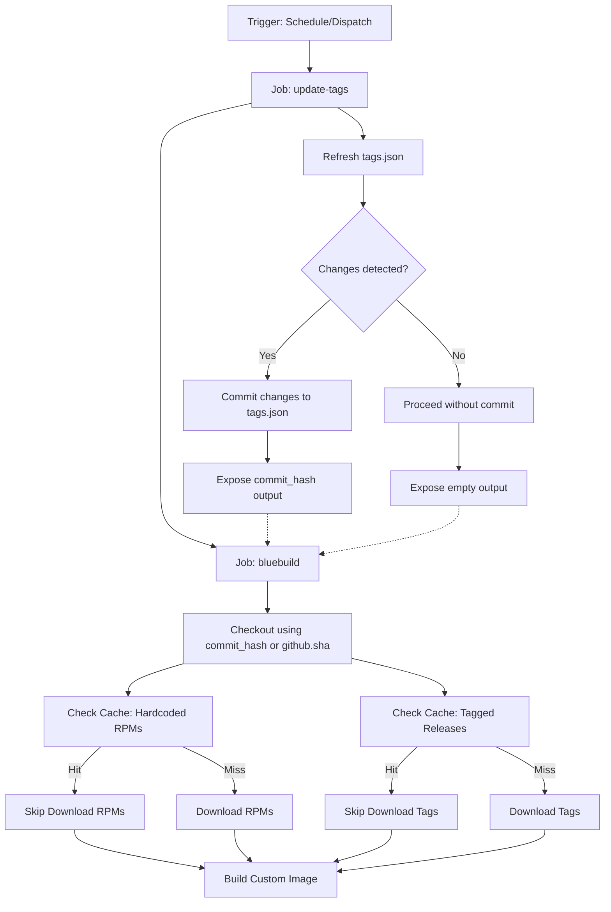

# GitHub Actions Cache Architecture

This document describes the design, configuration, and mechanics of the caching strategy used in the GitHub Actions workflows for this repository. The primary goal of this caching system is to optimize build times and minimize network overhead by preventing redundant downloads of RPM packages and tagged releases.

---

## Workflow Overview

The build workflow consists of two main jobs:

1. **`update-tags`**: Refreshes release tags from GitHub and commits any updates to `tags.json`.
2. **`bluebuild`**: Checks out the correct repository state, restores cached RPMs and releases, downloads missing files (if any), and builds the custom Fedora Atomic images.



---

## Caching Strategy

The workflow caches two distinct sets of files inside the `bluebuild` job to avoid downloading them on every run.

### 1. Hardcoded RPMs

* **Cache ID**: `rpm-cache`
* **Path**: `files/dnf/rpms`
* **Key**: `rpm-cache-${{ hashFiles('src/ublue_images/files.json') }}`
* **Skip Condition**: `if: steps.rpm-cache.outputs.cache-hit != 'true'`
* **Download Command**: `uv run ublue-images rpms download`

This step caches external RPM packages that are explicitly defined with fixed URLs in `src/ublue_images/files.json`. If the contents of `files.json` do not change, the hash remains identical, resulting in a cache hit. The `files/dnf/rpms` directory is restored, and the download step is skipped.

### 2. Tagged Releases

* **Cache ID**: `tag-cache`
* **Path**: `files/dnf/tags`
* **Key**: `tag-cache-${{ hashFiles('src/ublue_images/tags.json') }}`
* **Skip Condition**: `if: steps.tag-cache.outputs.cache-hit != 'true'`
* **Download Command**: `uv run ublue-images tags download`

This step caches RPM packages that are fetched based on the latest tagged releases of external repositories, defined in `src/ublue_images/tags.json`. When a new release is detected and `tags.json` is updated, the file hash changes, causing a cache miss. On a cache miss, the updated releases are downloaded and cached under the new key.

---

## Why `restore-keys` Is Omitted

In standard GitHub Actions cache configurations, `restore-keys` is often used to provide a fallback key (e.g., prefix-based) to restore files from a previous build if an exact match is not found. However, in this repository, `restore-keys` has been intentionally omitted.

### The Downloader Behavior

The Python download script (`GitHubReleaseDownloader` in `src/ublue_images/github_release_download.py`) implements a clean-slate policy for downloads. When executing `download_files`, the script performs the following actions:

```python
def download_files(self, config: ReleaseItems, output: str = "files/dnf/rpms") -> None:
    logger.info(f"Starting download of {len(config.items)} files to {output}")
    if os.path.exists(output):
        logger.info(f"Removing output directory: {output}")
        shutil.rmtree(output)
    logger.info(f"Created output directory: {output}")
    os.makedirs(output)
    # ... download logic ...
```

### Redundancy of Fallback Caches

If a cache miss occurs and `restore-keys` were configured:

1. GitHub Actions would download and restore the old/stale files from a previous cache into the target directory (`files/dnf/rpms` or `files/dnf/tags`).
2. The download script would run because of the cache miss.
3. The very first action of the download script is to delete the target directory (`shutil.rmtree`) and recreate it empty (`os.makedirs`).
4. The script would then download all files from scratch.

As a result, any files restored via `restore-keys` would be immediately deleted without ever being used. Omitting `restore-keys` avoids wasting network bandwidth and runner execution time on restoring files destined for immediate deletion.

---

## Job Dependency and Stale Builds Prevention

The execution order and data flow between the `update-tags` job and the `bluebuild` job are carefully coordinated to prevent building images with stale tag configurations.

### The Stale Tag Problem

The `update-tags` job runs `uv run ublue-images tags refresh` to check for new upstream releases. If updates are found, it commits the changes directly to the repository using `stefanzweifel/git-auto-commit-action`.

Because GitHub Actions workflows are triggered by a specific commit SHA (`github.sha`), the subsequent steps in the workflow would normally check out that triggering SHA. However, if `update-tags` pushes a new commit, the triggering SHA becomes stale. Building with `github.sha` would mean:

* The build uses the old `tags.json` file.
* The cache keys are calculated using the old `tags.json` hash.
* The built image does not contain the latest software releases.

### The Solution: Dynamic Checkout Ref

To resolve this, the workflow passes the commit hash of the auto-committed changes from the `update-tags` job to the `bluebuild` job.

1. **Exposing the Output**: The `update-tags` job defines an output mapping the auto-commit action's output:

   ```yaml
   outputs:
     commit_hash: ${{ steps.auto-commit.outputs.commit_hash }}
   ```

2. **Declaring the Dependency**: The `bluebuild` job declares that it depends on `update-tags`:

   ```yaml
   needs: update-tags
   ```

3. **Conditional Checkout**: In the `Checkout` step of the `bluebuild` job, the `ref` parameter is dynamically resolved:

   ```yaml
   - name: Checkout
     uses: actions/checkout@v6
     with:
       ref: ${{ needs.update-tags.outputs.commit_hash || github.sha }}
   ```

If `update-tags` committed changes, `needs.update-tags.outputs.commit_hash` will contain the new commit hash, and the checkout step will pull that exact commit. If no changes were made, the output is empty, and the step falls back to `github.sha`. This ensures the build always runs against the most up-to-date configuration.
