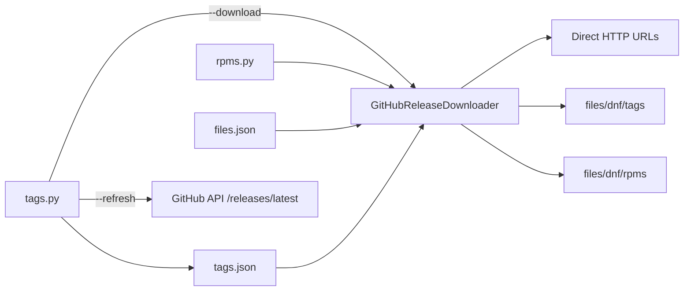

# `src/ublue_images` review — findings and fix progress

Review date: 2026-06-10

Scope: Python helpers under `src/ublue_images/`, CLI arguments, download/update logic, and CI/recipe integration.

Related files:

| Area | Paths |
| --- | --- |
| Core downloader | `src/ublue_images/github_release_download.py` |
| Tag refresh / download CLI | `src/ublue_images/tags.py` |
| Hardcoded RPM CLI | `src/ublue_images/rpms.py` |
| Config | `src/ublue_images/files.json`, `src/ublue_images/tags.json` |
| GitHub API model | `src/ublue_images/models/github.py` |
| CI | `.github/workflows/build.yml` |
| Image consumption | `recipes/_kinoite-dnf.yml` |
| Local commands | `justfile` (`update-github-release-tags`) |

---

## Architecture (current behavior)

- **`tags.py --refresh`**: For each item in `tags.json` with `repo`, fetches latest release tag and RPM URL from GitHub; rewrites `tags.json`.
- **`tags.py --download`**: Reads `tags.json`, downloads enabled items to `files/dnf/tags`.
- **`rpms.py`**: No subcommands; always runs `rpms()` → reads `files.json`, downloads enabled items to `files/dnf/rpms`.
- **CI** (`.github/workflows/build.yml`): Monday job refreshes `tags.json`; build job caches RPM dirs by config hash and runs download scripts on cache miss.

---

## Findings

Status legend: `[ ]` open · `[~]` in progress · `[x]` fixed · `[-]` wontfix / deferred

### F1 — GitHub release Pydantic model stricter than API (High)

- [x] **Status**
- **Severity:** High
- **Symptom:** `tags.py --refresh` can fail during `GithubReleases.model_validate()` even when the GitHub API returns a valid release.
- **Location:** `src/ublue_images/models/github.py`, used from `get_latest_release()` in `github_release_download.py`.
- **Cause:** Model generated from a single sample (`datamodel-codegen` / `justfile` `github-release-download`) treats many fields as required non-null strings. GitHub’s documented release/asset schema allows nulls (e.g. `name`, `body`, `published_at`, `updated_at`, asset `label`, `digest`, `uploader`).
- **References:**
  - [REST API — releases](https://docs.github.com/v3/repos/releases)
  - [REST API — release assets](https://docs.github.com/en/rest/releases/assets)
  - Asset `digest` is documented as `string | null` ([changelog](https://github.blog/changelog/2025-06-03-releases-now-expose-digests-for-release-assets/))
- **Suggested fix:**
  - Regenerate or hand-edit model with `str | None` (and optional nested types) aligned to current schema; or validate only fields used (`tag_name`, `assets[].name`, `assets[].browser_download_url`).
  - Re-run `just github-release-download` only if the input JSON is representative; prefer schema-driven generation or a minimal custom model.
- **Verify:** `uv run ublue-images tags refresh` against all repos listed in `tags.json`.

---

### F2 — `rpms.py` has no real CLI (Medium)

- [x] **Status**
- **Severity:** Medium
- **Symptom:** Any invocation runs the download path immediately. Verified before the Typer migration: `uv run src/ublue_images/rpms.py --help` and `uv run src/ublue_images/rpms.py --bogus` both start downloading (unknown args are ignored by Python when not parsed).
- **Location:** `src/ublue_images/rpms.py`
- **Impact:** Accidental runs, no `--help`, inconsistent with `tags.py`.
- **Suggested fix:**
  - Replace the script entrypoint with a Typer command such as `uv run ublue-images rpms download`.
  - Optional: expose `--config` / `--output` for local testing (defaults unchanged for CI).
- **Verify:** `uv run ublue-images rpms --help` prints usage and exits 0 without network I/O; unknown args exit non-zero.

---

### F3 — `tags.py` CLI: no required action, non-exclusive flags (Medium)

- [ ] **Status**
- **Severity:** Medium
- **Symptom:**
  - Before the Typer migration, `uv run src/ublue_images/tags.py` (no args) exited **0** and performed **no work**.
  - `--refresh` and `--download` are not mutually exclusive; `--refresh --download` runs only refresh (`elif` chain).
- **Location:** `src/ublue_images/tags.py`
- **References:** [Typer subcommands](https://typer.tiangolo.com/tutorial/subcommands/), [Typer packaging](https://typer.tiangolo.com/tutorial/package/)
- **Suggested fix:**
  - Replace flags with Typer subcommands: `uv run ublue-images tags refresh` and `uv run ublue-images tags download`.
  - If both operations are ever needed in one run, support explicit `uv run ublue-images tags sync` instead of silent combination behavior.
- **Verify:** `uv run ublue-images tags --help` prints help; documented behavior for supported subcommands is explicit.

---

### F4 — Download deletes output directory before any successful fetch (Medium)

- [ ] **Status**
- **Severity:** Medium
- **Symptom:** On failure mid-run, `files/dnf/rpms` or `files/dnf/tags` may be empty or partial while the recipe still expects RPMs (`recipes/_kinoite-dnf.yml`: `rpms/protonmail-bridge.rpm`, `tags/dbeaver.rpm`).
- **Location:** `download_files()` in `github_release_download.py` (`shutil.rmtree` then per-file download).
- **Suggested fix:**
  - Download to a temp directory (or write each file to `*.part` then rename), then atomic replace/rename into `output`.
  - Or remove tree only after all enabled downloads succeed.
- **Verify:** Simulate HTTP failure on second item; previous outputs or temp dir should remain recoverable.

---

### F5 — HTTP: no timeouts, full buffering in memory (Medium)

- [x] **Status**
- **Severity:** Medium
- **Symptom:** `requests.get(url)` with default `timeout=None` can hang indefinitely; `_download()` loads entire RPM into memory via `response.content`.
- **Location:** `get_latest_release()`, `_download()`, `download_file_to_local_dir()` in `github_release_download.py`
- **References:** [Requests timeouts](https://requests.readthedocs.io/en/latest/user/quickstart/#timeouts), [streaming with `iter_content`](https://requests.readthedocs.io/en/latest/user/advanced/#body-content-workflow)
- **Suggested fix:**
  - Pass explicit timeouts (connect + read) on API and asset GETs.
  - Use `stream=True` and `iter_content(chunk_size=...)` when writing files.
  - Optional: shared `requests.Session` with retries for transient errors.
- **Verify:** Large RPM download uses bounded memory; hung server fails within timeout.

---

### F6 — GitHub API: no auth headers (Low / operational)

- [ ] **Status**
- **Severity:** Low (until rate-limited)
- **Symptom:** Unauthenticated `GET /repos/{owner}/{repo}/releases/latest` shares a low rate limit on GitHub Actions IPs.
- **Location:** `get_latest_release()`
- **Suggested fix:** Optional `GITHUB_TOKEN` / `GH_TOKEN` from env (`Authorization: Bearer`, `Accept: application/vnd.github+json`, API version header per [GitHub docs](https://docs.github.com/v3/repos/releases)).
- **Verify:** Refresh still works without token locally; CI uses `GITHUB_TOKEN` when present.

---

### F7 — RPM asset selection heuristic (Low)

- [ ] **Status**
- **Severity:** Low
- **Symptom:** `get_rpm_download_url()` picks the first asset whose name ends with `x86_64.rpm`. Multiple matching assets or different naming (e.g. `linux-x86_64.rpm` as in current `dbeaver` URL) may pick the wrong file or raise `ValueError`.
- **Location:** `get_rpm_download_url()` in `github_release_download.py`
- **Current data:** `tags.json` dbeaver asset name pattern: `dbeaver-ce-26.1.0-linux-x86_64.rpm` (does not end with `x86_64.rpm` only — actually it ends with `linux-x86_64.rpm`, not `x86_64.rpm`). **Worth re-checking:** the code checks `endswith("x86_64.rpm")` which `...linux-x86_64.rpm` satisfies.
- **Suggested fix:** Prefer explicit `name` glob/regex per item in `tags.json`, or match `x86_64` + `.rpm` more deliberately; fail with asset list in error message.
- **Verify:** Refresh for each configured repo resolves expected RPM URL.

---

### F8 — Dead / legacy code and dependencies (Low)

- [ ] **Status**
- **Severity:** Low
- **Symptom:** Large commented blocks (B2/S3, joblib cache) in `github_release_download.py`; `load_dotenv()` with no documented env vars for downloads; `pyproject.toml` lists `joblib` but it is unused in active code.
- **Suggested fix:** Remove dead code or restore feature behind clear docs; drop unused dependencies if nothing references them.
- **Verify:** `uv run` / CI still pass; lockfile updated if deps removed.

---

### F9 — `refresh_tags()` writes `tags.json` even when only some items update (Low)

- [ ] **Status**
- **Severity:** Low
- **Symptom:** Loop may update one item then fail on a later repo; partial in-memory state is still written only at end — but a failure before `write_text` aborts without saving partial updates (good). If `get_rpm_download_url` fails after tag bump in memory, file on disk is unchanged (good). If write happens after mixed success without transactional semantics, document expected behavior.
- **Suggested fix:** Clarify in code/logs; optional per-item try/except so one bad repo does not block others (product decision).
- **Verify:** One broken repo in `tags.json` — desired CI behavior documented and tested.

---

## CLI reference (as reviewed)

| Command | Documented args | Actual behavior |
| --- | --- | --- |
| `ublue-images tags` | `refresh`, `download`, `--help` | Grouped Typer subcommands |
| `ublue-images rpms` | `download`, `--help` | Grouped Typer subcommands |

CI usage:

- `uv run ublue-images tags refresh` (update-tags job)
- `uv run ublue-images rpms download` (cache miss)
- `uv run ublue-images tags download` (cache miss)

---

## Suggested fix order

1. **F1** — Unblocks scheduled tag updates.
2. **F4** + **F5** — Safer downloads for CI and local builds.
3. **F2** + **F3** — CLI ergonomics and foot-gun removal.
4. **F6**, **F7**, **F8**, **F9** — Hardening and cleanup.

---

## Changelog (fixes)

| Date | Finding | Notes |
| --- | --- | --- |
| 2026-06-10 | F1 | Minimal `models/github.py`; full snapshot in `github_raw.py` via `just github-release-download`. |
| 2026-06-10 | F5 | Added explicit request timeouts and streamed file downloads with `iter_content()`. |

_Add a row when a finding is fixed (PR link optional)._
